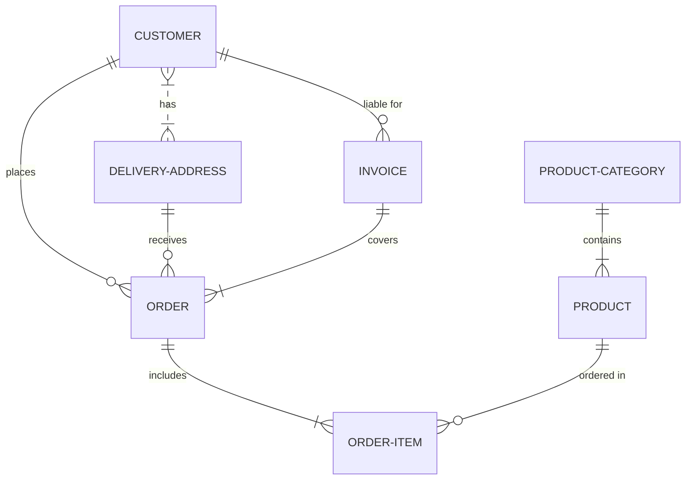

# Proyecto de Estudio

# Gestión de Tareas

**Asignatura**: Bases de Datos I (FaCENA-UNNE)

**Integrantes**:

- Barrios, Enzo Tomas
- Bongiovanni, Iara Aylen
- Diaz, Franco Benjamin
- Marano, Bruno Joel

**Año**: 2025

## CAPÍTULO I: INTRODUCCIÓN

### Caso de estudio

El presente trabajo práctico tiene como finalidad el diseño y modelado de una base de datos para la gestión de cadetes dentro de una empresa. El sistema busca organizar de manera eficiente las tareas y proyectos que los cadetes deben realizar, asegurando un mejor seguimiento de sus responsabilidades, roles y estados de avance.

### Definición o planteamiento del problema

En muchas empresas, los cadetes cumplen un rol esencial para realizar tareas externas (trámites, entregas, correspondencia, compras, etc.), pero a menudo la asignación y control de esas tareas se realiza de manera manual o informal, lo que genera varios inconvenientes:
● Pérdida de información sobre las tareas realizadas.

● Dificultad para hacer un seguimiento del estado de cada trámite.

● Problemas en la asignación de responsabilidades entre los cadetes.

● Falta de un registro histórico que permita evaluar eficiencia y desempeño.

Ante esta situación, surge la necesidad de un sistema de base de datos que permita centralizar la información de los proyectos y tareas de los cadetes, mejorando el control, la organización y el análisis de la información.

Objetivo General:
Desarrollar una base de datos que permita gestionar las tareas y proyectos de los cadetes de una empresa, garantizando la asignación eficiente de actividades, el control de estados y la trazabilidad de la información.
Objetivos Específicos:
● Diseñar un modelo de datos que contemple usuarios (cadetes), proyectos, tareas, estados, categorías y roles.
● Implementar una estructura que permita asignar tareas a cadetes de manera clara y controlada.

● Registrar los estados de cada tarea (pendiente, en proceso, finalizada, cancelada).

● Clasificar las tareas por categorías para un mejor análisis (ejemplo: trámites bancarios, mensajería, compras).

● Incorporar comentarios como mecanismo de seguimiento de cada actividad.

● Generar un sistema de registros que facilite la obtención de reportes históricos y de desempeño.

## CAPITULO II: MARCO CONCEPTUAL O REFERENCIAL

En la actualidad, las empresas buscan optimizar la gestión de tareas internas y externas para mejorar su productividad. Los cadetes cumplen un rol fundamental, ya que son responsables de trámites, entregas, correspondencia y diversas actividades que requieren organización y control.
El diseño de una base de datos relacional permite centralizar y estructurar la información relacionada con estas tareas, garantizando integridad, trazabilidad y eficiencia en la administración.
Los conceptos fundamentales que sustentan el proyecto son:
● Base de datos relacional: modelo que organiza la información en tablas relacionadas entre sí mediante claves primarias y foráneas, garantizando la integridad de los datos.

● Gestión de tareas: práctica que permite organizar, asignar y controlar actividades específicas de una organización, mejorando la productividad y evitando pérdidas de información.

● Roles y usuarios: cada participante del sistema tiene un rol definido (ejemplo: cadete, supervisor), lo que permite controlar permisos y responsabilidades.

● Estados de tareas: permiten conocer en qué situación se encuentra cada actividad (pendiente, en curso, finalizada, cancelada).

● Categorías de tareas: posibilitan clasificar los distintos tipos de actividades (ejemplo: trámites bancarios, compras, mensajería).

● TICs (Tecnologías de la Información y la Comunicación): proporcionan herramientas que permiten digitalizar procesos que tradicionalmente se realizaban de forma manual.

De este modo, el sistema se fundamenta en innovaciones tecnológicas aplicadas a la gestión organizacional, contribuyendo a un mayor control, análisis y planificación de las actividades de los cadetes dentro de una empresa.

**TEMA 1 " ---- "**
Ut sed imperdiet risus. Maecenas vestibulum arcu vitae orci pretium pharetra. Suspendisse potenti. Fusce massa libero, fermentum eget elit in, tincidunt fermentum nunc. Cras imperdiet nisl elit, elementum gravida enim accumsan vel. Sed in sapien quis ante consectetur commodo id non nulla. Aenean lacinia, dolor convallis semper mattis, ante orci elementum nunc, eget feugiat risus neque in urna. Ut ut quam nec risus mollis convallis ornare ac odio. Phasellus efficitur posuere nibh, eget tempor augue pellentesque ac. Ut enim sem, imperdiet non est ut, blandit posuere dui. Curabitur at purus orci. Interdum et malesuada fames ac ante ipsum primis in faucibus.

**TEMA 2 " ----- "**
Ut sed imperdiet risus. Maecenas vestibulum arcu vitae orci pretium pharetra. Suspendisse potenti. Fusce massa libero, fermentum eget elit in, tincidunt fermentum nunc. Cras imperdiet nisl elit, elementum gravida enim accumsan vel. Sed in sapien quis ante consectetur commodo id non nulla. Aenean lacinia, dolor convallis semper mattis, ante orci elementum nunc, eget feugiat risus neque in urna. Ut ut quam nec risus mollis convallis ornare ac odio. Phasellus efficitur posuere nibh, eget tempor augue pellentesque ac. Ut enim sem, imperdiet non est ut, blandit posuere dui. Curabitur at purus orci. Interdum et malesuada fames ac ante ipsum primis in faucibus.

...

## CAPÍTULO III: METODOLOGÍA SEGUIDA

a) Descripción de cómo se realizó el Trabajo Práctico
El desarrollo del trabajo se llevó a cabo siguiendo las siguientes etapas:

1. Identificación del caso de estudio: se definió como problemática la falta de organización en la gestión de tareas y proyectos de los cadetes de una empresa.

2. Relevamiento de requerimientos: se analizaron las necesidades de información a gestionar: usuarios, roles, proyectos, tareas, estados, categorías y comentarios.

3. Diseño del modelo entidad-relación (MER): se identificaron las entidades, atributos y relaciones.

4. Normalización: se organizaron las tablas para evitar redundancias y asegurar consistencia de datos.

5. Construcción del diccionario de datos: se definieron formalmente los campos, claves primarias y foráneas.

6. Validación del modelo: se verificó que la base de datos cumpla con los objetivos del proyecto.

b) Herramientas (Instrumentos y procedimientos)
● Revisión bibliográfica y guía de cátedra: se utilizó la guía de elaboración del proyecto como marco de referencia metodológico.

● Diagramación: el modelo entidad-relación fue construido con la herramienta ERDPlus, que permite generar diagramas E/R, esquemas relacionales y exportar el modelo de datos.

● Análisis de requerimientos: se trabajó con ejemplos prácticos de las actividades típicas de los cadetes.

● Lenguaje SQL: se prevé la implementación del modelo en un gestor de base de datos (ejemplo: MySQL o PostgreSQL).

## CAPÍTULO IV: DESARROLLO DEL TEMA / PRESENTACIÓN DE RESULTADOS

En este capítulo se presentan los principales resultados obtenidos del análisis y diseño del sistema:

1. Identificación de entidades principales:

○ Usuario (cadetes de la empresa).

○ Proyecto (conjunto de tareas o actividades).

○ Tarea (unidad de trabajo a realizar por un cadete).

○ Estado (situación de cada tarea).

○ Categoría (clasificación de tareas).

○ Rol (función que cumple un usuario dentro de un proyecto).

○ Asignación (relación entre usuario, proyecto y rol).

○ Comentario (seguimiento de tareas).

2. Modelo entidad-relación (MER):

○ El diagrama diseñado muestra cómo se relacionan las entidades de forma clara y estructurada.

○ Se garantiza la integridad de los datos a través de claves primarias y foráneas.

### Diagrama conceptual (opcional)

Ejemplo usando Live Editor https://mermaid.js.org/ (ejemplo opcional)

### Diagrama relacional

### Diccionario de datos

Acceso al documento [PDF](doc/diccionario_datos.pdf) del diccionario de datos.

### Desarrollo TEMA 1 "----"

Fusce auctor finibus lectus, in aliquam orci fermentum id. Fusce sagittis lacus ante, et sodales eros porta interdum. Donec sed lacus et eros condimentum posuere.

> Acceder a la siguiente carpeta para la descripción completa del tema [scripts-> tema_1](script/tema01_nombre_tema)

### Desarrollo TEMA 2 "----"

Proin aliquet mauris id ex venenatis, eget fermentum lectus malesuada. Maecenas a purus arcu. Etiam pellentesque tempor dictum.

> Acceder a la siguiente carpeta para la descripción completa del tema [scripts-> tema_2](script/tema02_nombre_tema)

...

## CAPÍTULO V: CONCLUSIONES

Nunc sollicitudin purus quis ante sodales luctus. Proin a scelerisque libero, vitae pharetra lacus. Nunc finibus, tellus et dictum semper, nisi sem accumsan ligula, et euismod quam ex a tellus.

## BIBLIOGRAFÍA DE CONSULTA

1.  List item
2.  List item
3.  List item
4.  List item
5.  List item
